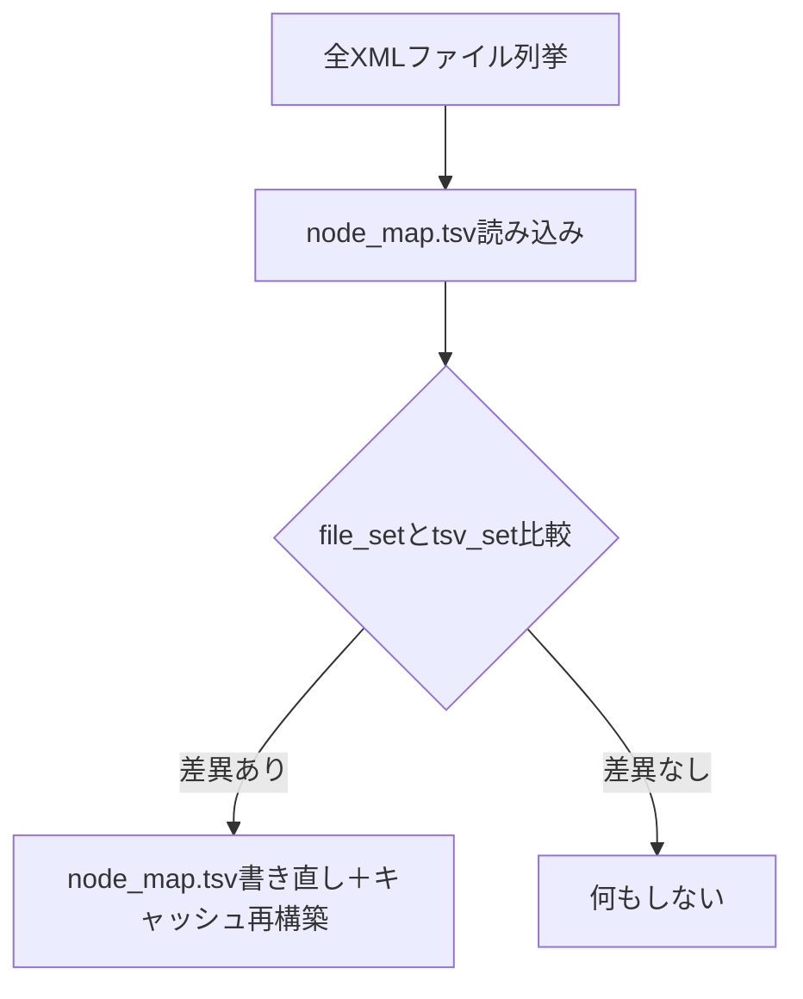
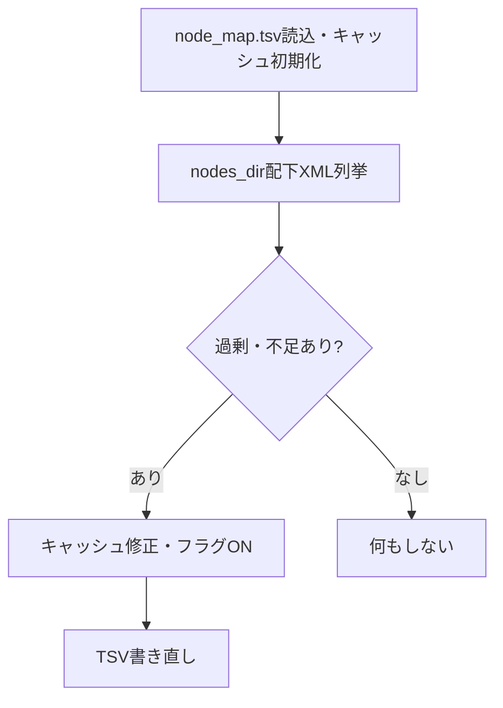

# `_check_and_update_node_map` 改善計画

## 用語定義：キャッシュ

- 本ドキュメントにおける「キャッシュ」とは、`self.tsv_entries`（TSVエントリのリスト）および`self.uuid_map`（(folder, filename)→uuidの辞書）を指す。
- これらはノードファイルとTSVの整合性管理・高速参照のために用いる。

## 現状の課題
- キャッシュ再初期化・TSV再読込が冗長
- uuid_mapの二重管理
- キャッシュ・TSV追記処理の重複
- 例外処理の粒度が粗い

---

## 改善計画

1. **キャッシュ再初期化・TSV再読込の省略**  
   差分があった場合、TSV書き直し時にキャッシュ（`self.tsv_entries`, `self.uuid_map`）も同時に構築し、再読込を省略する。

2. **uuid_mapの管理統一**  
   ローカル変数`uuid_map`を廃止し、`self.uuid_map`に統一する。

3. **キャッシュ・TSV追記処理の共通化**  
   `save_node`内のキャッシュ・TSV追記処理を関数化し、重複を排除する。

4. **例外処理の粒度見直し**  
   例外の種類を限定し、予期しない例外は再送出する。

---

## 新フロー（Mermaid）



---

## 実装方針
- 差分があれば、TSV書き直しループ内で`self.tsv_entries`と`self.uuid_map`も同時に更新
---

## `_check_and_update_node_map` 新設計・フロー

### 処理手順

1. `node_map.tsv`を読み込み、`tsv_entries`・`uuid_map`を初期化
2. `nodes_dir`配下の全XMLファイルを列挙
    - TSVに存在しないXML（不足）→ UUIDをXMLから取得し、キャッシュに追加、フラグON
    - TSVに存在するが実ファイルがない（過剰）→ キャッシュから削除、フラグON
3. フラグがONなら、TSVを書き直す（キャッシュ再構築は2で済んでいるので不要）

### フロー図


- 書き直し後の再読込・再初期化は不要
- `uuid_map`はインスタンス変数のみ
- キャッシュ・TSV追記は`_append_cache_and_tsv(folder, filename, uuid)`等で共通化
- 例外処理は必要な範囲に限定
---

## 既存ファイルUUID取得・TSV/キャッシュ追記フロー

- 既存ノードファイルが見つかった場合、XMLルート要素の`id`属性をUUIDとして取得し、`self.tsv_entries`/`self.uuid_map`/TSVに追記する。
- UUIDが取得できなかった場合は `str(uuid.UUID(int=0))`（ゼロUUID）を返す。
- UUID取得用の補助関数（例: `_get_uuid_from_xml(path)`）を追加する。

```mermaid
flowchart TD
    S[空き(folder, filename)探索] --> X{既存XMLファイルあり?}
    X -- あり --> Y[UUID取得(_get_uuid_from_xml)]
    Y --> Z[キャッシュ・TSVに追記]
    Z --> R[folder, filename, folder_pathを返す]
    X -- なし --> R
```
