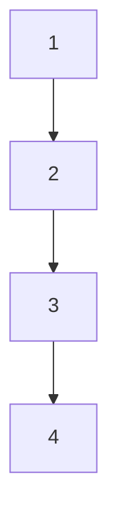
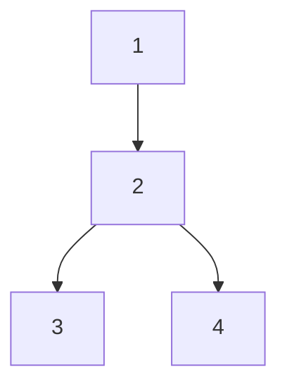
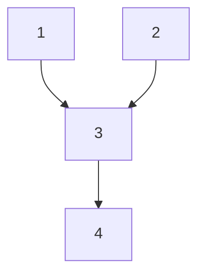
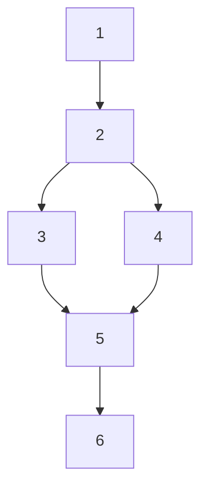
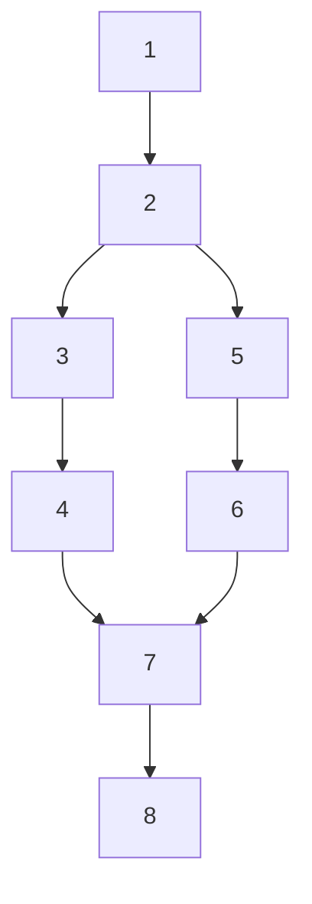
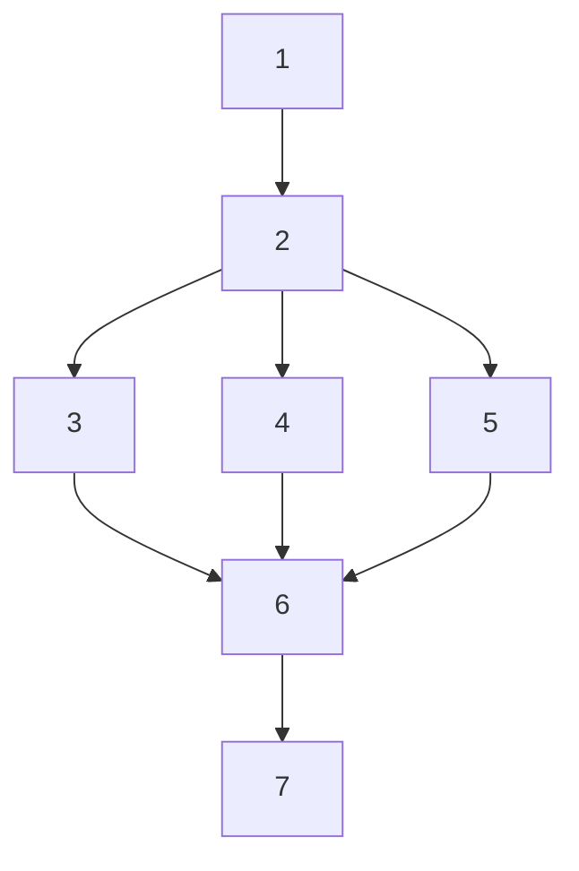

# convert_map 実装設計案

## 目的
履歴（ノードIDリスト）を、分岐・合流でネストされたテキスト表現に変換する。

## 要件
- 入力: ノードIDのリスト（history）
- 出力: 分岐・合流ネスト表現のテキストリスト
- ノードは出現順に1,2,3,...と連番を振る
- 分岐点（out-degree>1）で"<"、合流点（in-degree>1）で">"を付加
- ネストは数えず、2行目以降はスペース2つでインデント
- 1つの履歴（history）は単一パスなので、複数パス同時処理は不要

## アルゴリズム詳細
1. historyリストを先頭から走査し、各ノードに連番を割り当てる
2. 各ノードでout-degree, in-degreeを計算
3. out-degree>1なら分岐開始（<）、in-degree>1なら合流終了（>）
4. ネストレベルは管理せず、2行目以降はスペース2つでインデント
5. 各ノードを「連番→連番」形式で出力、必要に応じて"<", ">"を付加

## Mermaid図と出力例

### 1: 直線パス

```
1→2→3→4
```

### 2: 分岐のみ

```
1→2<
  2<3
  2<4
```

### 3: 合流のみ

```
1>3
  2>3
  >3→4
```

### 4: 分岐と合流がある例 1

```
1→2<
  2<3>5
  2<4>5
  >5→6
```

### 5: 分岐と合流がある例 2

```
1→2<
  2<3→4>7
  2<5→6>7
  >7→8
```

### 6: 3分岐・3合流

```
1→2<
  2<3→6>7
  2<4→6>7
  2<5→6>7
```
