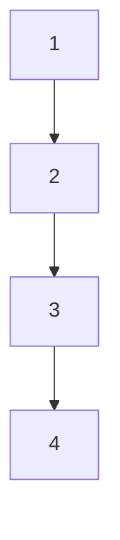
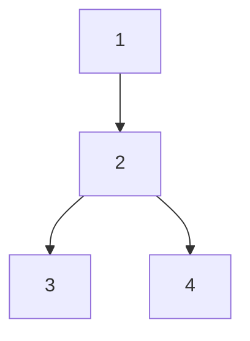
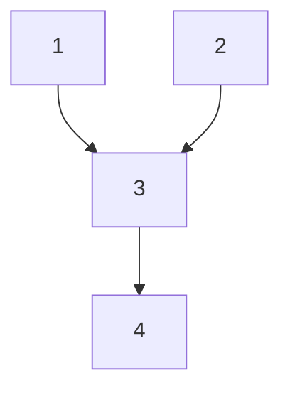
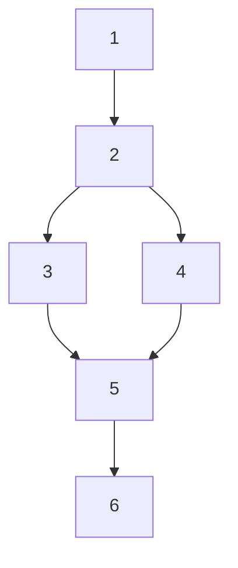
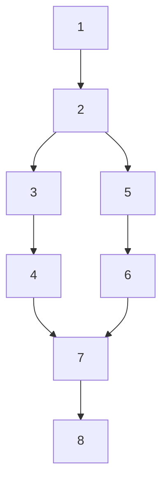
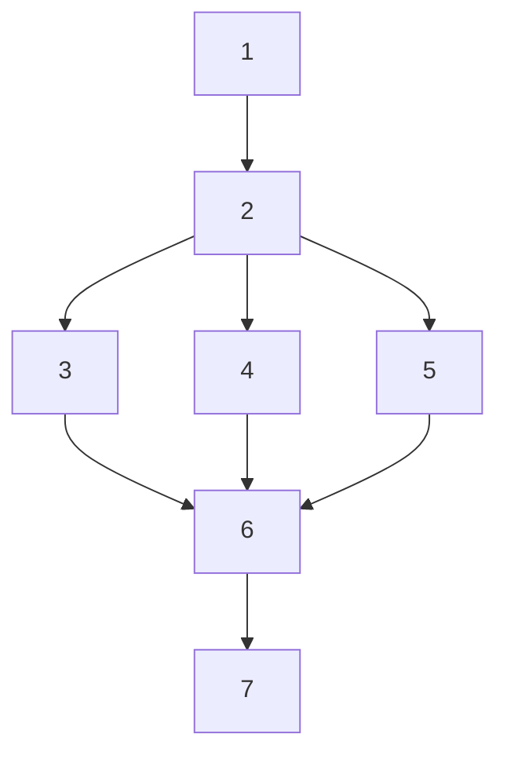
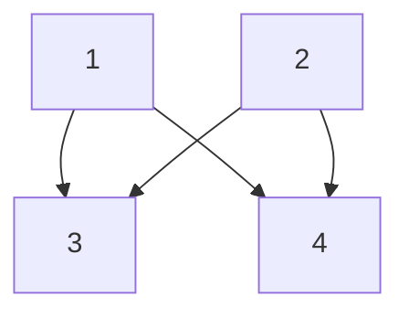
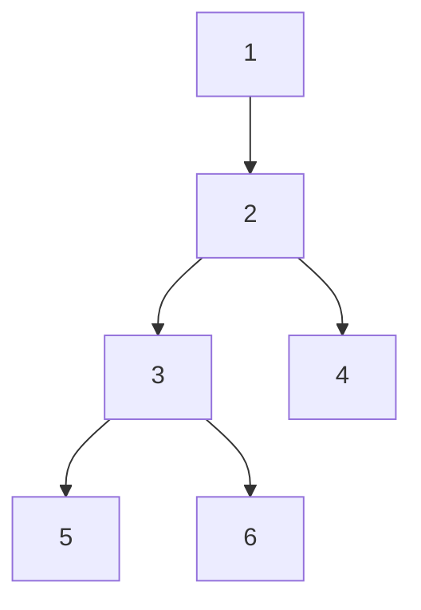

# convert_map 実装設計案

## 目的
履歴（ノードIDリスト）を、分岐・合流でネストされたテキスト表現に変換する。

## 仕様
- 入力: ノードIDのリスト（history）、出力: テキスト行のリスト
- ノードは出現順に1,2,3,...と連番を振る
- 分岐点（out-degree>1）で"<"、合流点（in-degree>1）で">"を付加
- スタートノード（先行なし）は深さ0（インデントなし）、分岐エッジは深さd（2d スペース）、入れ子で1増える
- マージ継続は分岐エッジの深さより1小さい（分岐が解消されたらインデントを下げる）

## Mermaid図と出力例

### 1: 直線パス

```mermaid
flowchart TD
    1 --> 2
    2 --> 3
    3 --> 4
```
```
1→2→3→4
```

### 2: 分岐のみ

```mermaid
flowchart TD
    1 --> 2
    2 --> 3
    2 --> 4
```
```
1→2<
  2<3
  2<4
```

### 3: 合流のみ

```mermaid
flowchart TD
    1 --> 3
    2 --> 3
    3 --> 4
```
```
1>3
2>3
>3→4
```

### 4: 分岐と合流がある例 1

```mermaid
flowchart TD
    1 --> 2
    2 --> 3
    2 --> 4
    3 --> 5
    4 --> 5
    5 --> 6
```
```
1→2<
  2<3>5
  2<4>5
>5→6
```

### 5: 分岐と合流がある例 2

```mermaid
flowchart TD
    1 --> 2
    2 --> 3
    2 --> 5
    3 --> 4
    5 --> 6
    4 --> 7
    6 --> 7
    7 --> 8
```
```
1→2<
  2<3→4>7
  2<5→6>7
>7→8
```

### 6: 3分岐・3合流

```mermaid
flowchart TD
    1 --> 2
    2 --> 3
    2 --> 4
    2 --> 5
    3 --> 6
    4 --> 6
    5 --> 6
    6 --> 7
```
```
1→2<
  2<3>6
  2<4>6
  2<5>6
>6→7
```

### 7: 交差

```mermaid
flowchart TD
    1 --> 3
    1 --> 4
    2 --> 3
    2 --> 4
```
```
1<
  1<>3
  1<>4
2<
  2<>3
  2<>4
>3
>4
```

### 8: 入れ子分岐

```mermaid
flowchart TD
    1 --> 2
    2 --> 3
    2 --> 4
    3 --> 5
    3 --> 6
```
```
1→2<
  2<3<
    3<5
    3<6
  2<4
```
